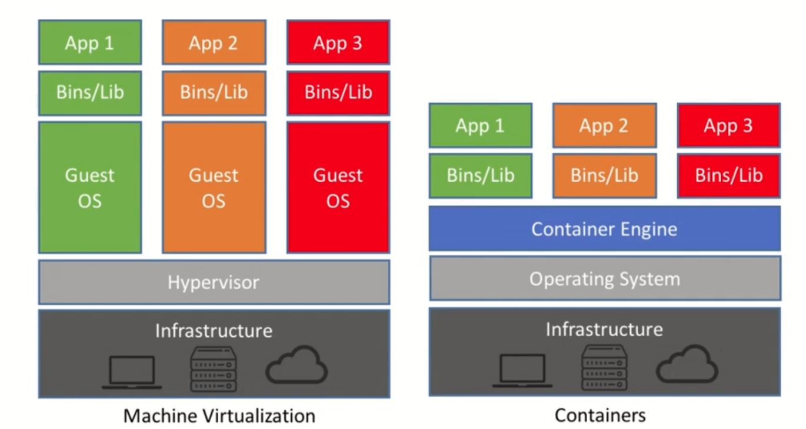

<hr id="top"/>

## Table of contents

- [Definition et concepts](#definition_et_concepts)
- [1- Premiers pas avec Docker](#setup)
    <!-- - [Docker VS Machine Virtuelle](#packaged-distributions) -->
  
<!-- - [2- Premiers pas avec Docker](#setup) -->
<!-- - [3- Premiers pas avec Docker](#setup) -->


### Definition et concepts [#](#definition_et_concepts)
<!-- #### Install [node.js](#nodejs-version-compatibility) -->
<p align="right">(<a href="#top">back to top</a>)</p>

#### Emulation
> L'émulation est une technique qui consite à exécuter un système sur un autre.

#### Simulation
> La simulation consiste a reproduire à l'identique un système. Il se fait généralement en utilsant des modèles mathématiques ou des algorithmes.

#### Virtualisation
> La virtualisation est une technologie en informatique, qui permet de partager les resources d'un hotes pour creer des machines virtuelles.

> **Utilité :** Meilleur utilisation des ressources de l'hôte. Isolation complête ou partielle des machines virtuelle par rapport à l'hotes (les ressources: RAM, Processeur, ROM du système de l'hotes sont allouée et dédié à l'environnement).

#### Contenerisation
> Est un processus qui consiste à embarquer le code d'une application avec les fichiers et bibliothèques dont il a besoin pour s'exécuter dans n'importe quelle environnement.


#### Conteneur
> Un conteneur Linux est un processus ou un ensemble de processus isolé du système hote tout en restant légé.
Il permet de faire de la virtualisation légère c'est à dire, ne réserve pas les resources (RAM, Processeur, ROM) du systèmes hôtes mais les partages avec ce dernier.


#### Docker
> Docker est un environnement d'execution de conteneur. Il utilise une technologie de conteneurisation et donc permet de partager le noyau du système.

> Exemple d'environement de conteneurisation: Podman, LXC, OpenVZ, etc...

> **Avantages:** 
> - Volumetrie, 
> - Permet de faire du Microservice (On découpe chaque partie de l'application en des petits blocs qui peuvent être replicable: Base de donnée, Apache, etc...) Donc bien segmenté!

> On découpe l'application en ensemble de service: 
> - la base de données
> - le serveur web (Nginx / Apache)
> - le service applicatif ..

### 1- Premier pas avec Docker
<p align="right">(<a href="#top">back to top</a>)</p>

Comparaison Machine Virtuelle VS Conteneur Docker

<p style="text-align: center;">
    
</p>
<p style="text-align: center; text-decoration: underline;;"><b>Virtualization VS Container</b></p>


#### Docker Installation

[Link](https://docs.docker.com/engine/install/linux-postinstall/)

Check if docker has installation candidate

```BASH
sudo apt update
sudo apt-cache search docker.io

-- OUTPUT 
docker-doc - Linux container runtime -- documentation
docker.io - Linux container runtime
python3-docker - Python 3 wrapper to access docker.io's control socket
ruby-docker-api - Ruby gem to interact with docker.io remote API
```

If you have an output like this. You can install it :

```BASH
sudo apt install docker.io
```

After the installatoin is done, add docker group and edit the docker user group

```BASH
sudo groupadd docker
sudo usermod -aG docker $USER
newgrp docker

# Type this to check if your user is in the group
groups
```

#### Lancer notre premier conteneur Docker

```BASH

# On telecharge l'image de conteneur
docker pull alpine:latest

# run le container
docker run alpine:latest
```

Check if container is running

```BASH
docker ps
```

If the output is empty, retry the command with `-a` option

```BASH
docker ps -a
CONTAINER ID   IMAGE           COMMAND     CREATED          STATUS                      PORTS     NAMES
22de6f1da974   alpine:latest   "/bin/sh"   16 seconds ago   Exited (0) 15 seconds ago             naughty_cohen
```

Avec cette commande, on se rend compte que l'image à été lancé mais elle a un status `Exited`. Ce qui veut dire qu'une fois que la machine a rendu son service, elle s'est arrêté !

Pour garder l'image en fonction :

```BASH
docker run -di --name=first_alpine alpine:latest
# d: detached
# i: interractive
# --name : pour preciser un nom de conteneur

# --- OUTPUT 
# When the command run without error, It return a hash
6a4c7bacc18b4f94308fb672f4621652c3caf9d85d35533adde53f94639ababe
```

Pour verifier si le conteneur est bien en cours d'execution, on execute la fonction suivante:

```BASH
docker ps

# --- OUTPUT 
# When the command run without error, It return a hash
CONTAINER ID   IMAGE           COMMAND     CREATED             STATUS             PORTS     NAMES
6a4c7bacc18b   alpine:latest   "/bin/sh"   About an hour ago   Up About an hour             first_alpine
```

Et à présent, on peu se connecter sur le conteneur

```BASH
docker exec -ti first_alpine sh 
# t : tty
# i : interactive
# first_alpine : Running container name || we can use container id
# sh : process to run
    # $ ps

# Inside the container, we can do some actions:
ifconfig # Get the network configuraiton
ls # list directory
tree # List directory architecture
pwd 
apk --help
apk update
apk search paquage_name_pattern
apk add paquage_name_pattern

#### Ex:
apk add php82
php -v
PHP 8.2.17 (cli) (built: Mar 14 2024 21:23:39) (NTS)
# you can write a PHP script and try to execute it with 

```

---

### 2- Lancer conteneur NGINX [#](#definition_et_concepts)

<p align="right">(<a href="#top">back to top</a>)</p>

Ici, on va lancer un conteneur Nginx et faire une redirection de port vers un des ports de notre hôte physique

```BASH
docker run -tid -p 8080:80 --name nginx_web_srv nginx:latest 

# -d : Cette option permet de donner la main a l'utilisateur pour qu'il continu d'utiliser son terminal

# --- OUTPUT 
# When the command run without error, It return a hash
730fff06b9b3709addc5b0ad35f08609b1c76b5fc7191332f493561de7d70ff6
```

Une fois lancer, on peut allez dans notre navigateur et essayer de se connecter au port 8080 de notre host local a l'adresse:

http://localhost:8080


Et pour avoir des details sur un conteneur, il y a la commande suivante
```BASH
docker inspect container_id||container_name

# Avec cette commande, on peut avoir des details comme: l'IP, etc...
```

---

### 3- Monter un volume persistant (Utilisation de volume docker par la commande docker run)
<p align="right">(<a href="#top">back to top</a>)</p>

Par default, les conteneurs sont stateless. Cet etat leurs permets de s'executer ou s'arreter tres rapidement. De cette maniere, ils sont purement orienter sur le service qu'il doit rendre

Les volumes nous permettent d'avoir des données persistantes que l'on peut utiliser à n'importe quel moment, que ce soit au démarrage, au redémarrage d'un conteneur, ou à tout autre instant.

Les volumes nous permettent donc de créer des conteneurs stateful, c'est-à-dire des conteneurs capables de conserver des données ou configuration entre les redémarrages.

**Exercice:** on va arreter puis redemarrer notre conteneur Nginx

```BASH

# Afficher la list de nos container 
docker ps                                                   
CONTAINER ID   IMAGE          COMMAND                  CREATED          STATUS          PORTS                                   NAMES
730fff06b9b3   nginx:latest   "/docker-entrypoint.…"   28 minutes ago   Up 28 minutes   0.0.0.0:8080->80/tcp, :::8080->80/tcp   nginx_web_srv

# Arretez notre container 
docker stop 730fff06b9b3

# Verifiez si notre conteneur est toujours en cours d'execution avec la commande <<docker ps>>

# Redemarrer notre conteneur
# docker start container_id||container_name
docker start nginx_web_srv

# Now, we'll connect to the container
docker exec -ti nginx_web_srv sh

# Then we'll install vi, vim & nano
apt update
apt install vi vim nano -y
# (Here, I try the command apk but it don't work I think the repository management is based on the image we are using...)

# We'll edit nginx default page 
# To to it, first we need to check the default page file location in Nginx default configuration file
cat /etc/nginx/conf.d/default.conf

```


After I run this command, I got output like this :

```BASH
server {
    listen       80;
    listen  [::]:80;
    server_name  localhost;
    .
    .
    .
    error_page   500 502 503 504  /50x.html;
    location = /50x.html {
        root   /usr/share/nginx/html;
    }
}
```

Now we can edit the Nginx defaut page. You can add any thing you want in it.

```BASH
# Check if the file exist
cat /usr/share/nginx/html/index.html

# Open your preferred shell editor and change something in the file
vim /usr/share/nginx/html/index.html
```

Nous allons juste verifier si les modifications sont bien prit en compte.

After editing and saving the default web page file, we go to localhost:8080 to check changes. If every change is apply, we can wdelete the docker container! 

```BASH
docker rm -f nginx_web_srv
```

After that, we can run again our Nginx web server
```BASH
docker run -tid -p 8080:80 --name nginx_web_srv nginx:latest

# To check
docker ps 
```

Go to http://localhost:8080 you will see that your previous modifications wasn't persiste.
To solve that problem, docker use the concept of volume. So the purpose here is to use host folder as externe disk wich we can use to store and persiste data the container will use.

```BASH
# We create docker volume directory on the local host
mkdir /home/tchedem/projects/linux/docker/volumes

# We delete the running nginx container
docker rm -f nginx_web_srv

# We start the container and this time, we mount a volume in the container 
docker run -tid -p 8080:80 -v /home/tchedem/projects/linux/docker/volumes:/usr/share/nginx/html --name nginx_web_srv nginx:latest
```

After this, if you try to access the nginx service default page, you will get 403 Forbiden Error. Because the file index.html doesn't exist. To solve the problem, we'll create a new file

```BASH
cd /home/tchedem/projects/linux/docker/volumes

echo "Hello Tchedem" > index.html
```

And then, we reload the page and it work now fine.
---


### 4- Gestion des volume avec Docker volumes
<p align="right">(<a href="#top">back to top</a>)</p>

Here, we'll use the `docker cli` to manage volumes


```BASH 
docker volume

Usage:  docker volume COMMAND

Manage volumes

Commands:
  create      Create a volume
  inspect     Display detailed information on one or more volumes
  ls          List volumes
  prune       Remove all unused local volumes
  rm          Remove one or more volumes

Run 'docker volume COMMAND --help' for more information on a command.
```

Let's create a volume

```BASH
docker volume create monvolume
```

To get the list of volumes
```BASH
docker volume ls
```

To get informations about a volume, you can use the command bellow

```BASH
docker volume inspect monvolume
[
    {
        "CreatedAt": "2024-03-17T14:01:38+01:00",
        "Driver": "local",
        "Labels": {},
        "Mountpoint": "/var/lib/docker/volumes/monvolume/_data",
        "Name": "monvolume",
        "Options": {},
        "Scope": "local"
    }
]
```

To use a volume in a container 
```BASH
docker run -tid --name nginx_web_srv -p 8080:80 --mount source=monvolume,target=/usr/share/nginx/html nginx:latest

### OUTPUT
> fa9eabb07dcb39340b67a92e4b4ce9241f013e9a0328fa6d6a8c9cd9aafd553d
```

After the creation of the docker container, we'll change some of his files in the volume mountpoint. 

```BASH
docker volume inspect monvolume

# -- OUTPUT
.
.
"Mountpoint": "/var/lib/docker/volumes/monvolume/_data",
.
.

# On windows
# \\wsl$\docker-desktop-data\version-pack-data\community\docker\volumes\monvolume\_data
```

Change directory to entrypoint folder and edit the `index.html` file to check if the modification apply on Nginx default web page. Got to http://localhost:8080 And then boom It's work!

To delete a volume
```BASH
docker volume rm monvolume 
# NB: Before using this command don't foget to delete container using this volume
```

If you want to delete all volumes 
```BASH
docker volume rm $(docker volume ls -q)
```

---

### 5- Comment passer une variable d'environement à un conteneur Docker
<p align="right">(<a href="#top">back to top</a>)</p>

Les variables d'environements sont des variables dynamique utilisé par divers processus d'un système d'exploitation ou d'une application.

```BASH
docker ps 
# docker image ls --format "{{.Repository}}\t{{.Tag}}\t{{.ID}}\t{{.CreatedSince}}\t{{.Size}}" | awk -F'\t' '{ if ($1 == "alpine") { printf "\033[0;31m%s\t%s\t%s\t%s\t%s\033[0m\n", $1, $2, $3, $4, $5 } else { print $0 } }'
docker image ls ||  docker images
REPOSITORY             TAG       IMAGE ID       CREATED        SIZE
ubuntu                 latest    ca2b0f26964c   2 weeks ago    77.9MB

# I have a ubuntu image. So, i'll send him a variable
docker run -tid --name testenv --env MYVARIABLE="12345" ubuntu:latest
```

Pour ce faire, on va se connecter au conteneur
```BASH
docker exec -ti testenv sh
```

When logged in the container, try to display environement variables:

```BASH
env
# -- OUTPUT
# > Return a list of env variables.
```


***Methode 2:*** Charger les variables denvironement avec un fichier

```BASH
echo 'DBNAME="db"
MYPASSWORD="12345"' > vars_env

docker run -tid --name testenv --env-file vars_env ubuntu:latest
docker exec -ti testenv sh

# Après que le fichier soit passer au conteneur, les variables qui y était seront disponible dans les variables d'enrinonnement du conteneur
env 

# OUTPUT
HOSTNAME=aa6061db70b9
HOME=/root
TERM=xterm
PATH=/usr/local/sbin:/usr/local/bin:/usr/sbin:/usr/bin:/sbin:/bin
DBNAME="db"
PWD=/
MYPASSWORD="12345"

```

NB: Il y a une variable d'environnement hostname qui est creer par docker si on veut le changer, on peut le defini dès le lancement du run:

```BASH
$ docker run -tid --name testenv --hostname tchedem testenv ubuntu:latest
$ docker exec -ti testenv sh

# And tape 
env
# To see if the modification is apply
```

---

### 6- Créer une image avec un conteneur
<p align="right">(<a href="#top">back to top</a>)</p>

##### C'est quoi une image de container ?

Une image de container peut être vue comme 

Pour créer une image docker, on à deux moyens:
- **Methode 1:** Le faire manuellement
- **Methode 2:** Le faire avec un DockerFile

##### Methode 1

La première méthode n'est pas très optimisé (On pull l'image, on démarre le conteneur, on sy connecte; on installe les outils dont on a besoin et on fait un commit après chaque modification)


```BASH

docker run -tid --name ubuntu_testenv --hostname ubuntu_testenv ubuntu:latest

docker exec -ti ubuntu_testenv sh

# When you are connected to the container
apt-get update && apt-get install vim git -y

```

Apres installation de ces paquages, on peut dire qn'on a une version customiser de notre image de base. Ce qu'il y a à faire maintenant, c'est faire un commit de l'image.

```BASH
# docker commit -m "Création test_env image" container_ID new_image_name:v1.0(This is tag)

docker commit -m "Création test_env image" ubuntu_testenv ubuntu_testenv:v1.0
# docker commit -m "Creation conteneur ubuntu_testenv" de3313693f73 tchedem_ubuntu:v1.0
```

Après le commit, une nouvelle image est crée automatiquement. Vous pouvez voir l'image comme ceci:

```BASH
docker images             
REPOSITORY             TAG       IMAGE ID       CREATED              SIZE
ubuntu_testenv                v1.0      6dfdf2db7484   About a minute ago   262MB
```

L'inconvenient majeure quand on veux recréer un conteneur de ce genre, on est obligé de pull l'image ubuntu et d'installer manuellement les paquages qu'on a déjà installé.


***Petit test pour vérifier si notre image a été créer :***

```BASH

docker image ls

docker run -tid --name container_tchedem_test ubuntu_testenv:v1.0

docker ps
# OUTPUT
# CONTAINER ID   IMAGE                 COMMAND       CREATED         STATUS         PORTS     NAMES
# 9d79ce9492a6   ubuntu_testenv:v1.0   "/bin/bash"   6 seconds ago   Up 5 seconds             container_tchedem_test

# Log in the container
docker exec -ti container_tchedem_test sh

# Check modifications apply on image
docker history img_ID 
# Nous permet d'avoir plus d'information sur les sequences qui ont été exécuté sur notre image

docker rm -f container_ID

docker rmi img_ID
```

##### Methode 2: Utiliser un DockerFile
Cette méthode sera abordé au chapitre suivant.


---

### 7- Dockerfile - Créer une image (Methode 2)
<p align="right">(<a href="#top">back to top</a>)</p>

Un Dockerfile est un fichier de configuration. Son objectif est de nous permettre de créer rapidement des images dockers.

Exemple d'instruction dans un Dockerfile:

```BASH
FROM: pull une image
RUN: lancement de commandes (apt ...);
ENV: variables d'environnement ;
EXPOSE: expositions de ports du conteneur ;
VOLUME: definition de volumes ;
COPY: cp entre host et conteneur ; (Pour copier des éléments entres le host docker et l'image)
ENTRYPOINT: processus maitre puisque l'idee d'un conteneur c'est d'avoir un seul processus qui tourne ; (Avec les system linux le process init est premier processus 'mother process' qui est démarrer et il se charge de démarrer les autres processus)
.
.
.
```

Avantage d'utiliser les Dockerfile: 

- Customiser nos images
- Relancer une création d'image à tout moment
- Meilleur visibilité sur ce qui est fait lors de la contruction de l'image
- Partage facile et possibilité de versionner nos images (au travers du Dockerfile)
- Création des images pour les environnement de **prod || dev || test** et dans le même temps de pouvoir faire du **CI/CD**

**Exemple de Dockerfile**

```BASH
nano Dockerfile

# Then paste this in the file
FROM ubuntu:latest
# MAINTANER tchedem
RUN apt-get update \
&& apt-get install -y vim git \
&& apt-get clean \ # nettoyer le cache
&& rm -rf /var/lib/apt/lists/* /tmp/* /var/tmp/*
```

Après la finalisation des instructions du Dockerfile, on va builder notre fichier.

```BASH
docker build -t img_name:version .
# docker build -t my_ubuntu_img:v1.0 .
# Le . a la fin permet de symboliser le Dockerfile


# OUTPUT EXEMPLE
docker build -t my_first_ubuntu_docker_img:v1.0 .

Sending build context to Docker daemon  2.048kB
Step 1/3 : FROM ubuntu:latest
 ---> ca2b0f26964c
Step 2/3 : MAINTAINER tchedem
 ---> Running in c3f851ebdbc6
Removing intermediate container c3f851ebdbc6
 ---> 9a688d67d7c1
Step 3/3 : RUN apt-get update && apt-get install -y vim git && apt-get clean && rm -rf /var/lib/apt/lists/* /tmp/* /var/tmp/*
 ---> Running in 3845de96ca5f
 .
 .
 .
 .
Removing intermediate container 3845de96ca5f
 ---> 6c74087823b1
Successfully built 6c74087823b1
Successfully tagged my_first_ubuntu_docker_img:v1.0

```

Après ceci, on peu verifier si l'image à été créer avec succès.

```BASH 
docker images
# OUTPUT EXAMPLE
REPOSITORY             TAG       IMAGE ID       CREATED         SIZE
my_first_ubuntu_docker_img       v1.0      6c74087823b1   3 minutes ago   211MB
```

Verifier les commandes qui ont été exécuté pour builder notre image:

```BASH 
docker history my_first_ubuntu_docker_img:v1.0
```

<!-- Then we'll run and connect to our container using the created image: -->
Ensuite, nous exécuterons et nous connecterons à notre conteneur à l'aide de l'image créée:

```BASH

docker run -tid --name custome_ubuntu_ctn my_first_ubuntu_docker_img:v1.0

docker exec -ti custome_ubuntu_ctn bash

```

Ici, tout marche bien et les commandes installer `git et vim` sont disponible dans le conteneur.


---

### 8- Dockers comprendre les layers & les couches

Parlons Lego 😆️

Le Lego, est un jeu de construction. Il est composé de pièces, d'accessoire varié, comme les figurines, des fleurs, etc. Son but est de permettre aux joueurs de combiner les pièces afin de construire des choses (objet ou structure).


Pour créer une image Docker, on peut utiliser un `Dockerfile`. Maintenant, imaginez les instructions possibles comme les pièces dans une boite de Lego et pour construire l'image, vous devez assembler ces instructions dans un Dockerfile. Chaque pièce ajoutée dans le Dockerfile, représente une couche. Si une pièce est changée, Docker se chargera de reexécuter juste le nouvel élément changé et utilisera sa stratégie de cache par défaut pour les autres éléments qui sont restés inchangés. Cela rend la construction des images facile et très rapide.


**Pour la suite recherhcer dans le fichier originale l'element suivant**

************************* <br>
Video 8: Dockers comprendre les layers & les couches
*************************


---

### 9- Docker Principes des MICROSERVICES et Demo

C'est quoi les microservices ? 

Ce concept est assez recent en architecture logicielle et il a pour but de fractionnez les applications et les environnement pour qu'elles puisse etre scalable et hautement disponible. Contrairement a l'approche monolithique ou la logique, le calcul et les vues sont toutes embarques dans une seule et meme application, les microservice decompose une application en plusierus services independants, chacun avec sa propore fonctionnalite specifique. Comme avantage, nous pouvons faire evoluer plus facilement et rapidement les services de maniere independante sans forcement impacter l'application dans son ensemble, nous pourvons rendrfe l'application plus scalable et rendre nos services plus disponible.


- scalabisé automatiquement en fonction de la charge
- augmentez la vitesse de deploiement (puisque les services vont etre plus petit, on va pouvoir les developper plus facilement déçu)
- réduire les single point of failure (SPOF)

**Exemple minimaliste**

- 1 page index.html à mettre à jour (on va afficher trois lignes qui présentent trois variable calculé)
- 3 variables calculées (bash)
- 4 conteneurs
  - 1 serveur web nginx (affichage de la page)
  - 3 conteneurs php (workers) => 1 par variable
  
*Project name* : **minimalist_micro_services**
Vous verrez dans le readme tou project, toutes le commandes necessaire pour pouvoir le demarrer


---

### 10- Fonctionnement du cache Docker
<p align="right">(<a href="#top">back to top</a>)</p>

Le but du cache docker c'est de contruire plus vite les images

* but
    - construire plus vite les images
    - démarrer plus vite les conteneurs
    - stocker des images légères
    - partage de couches/cache

**Demo:**

*Project name* : **docker_test_cache_system_for_image_building**
Vous verrez dans le readme toutes les instructions dont vous aurez besoins


### 11- Les réseaux avec Docker
<p align="right">(<a href="#top">back to top</a>)</p>

Les réseaux dockers 

###### Docker bridge

Sur Docker le réseau principal est le `docker bridge`. Sur la machine qui heberge Docker, on peu facilement l'identifier sous le libellé: `docker0`. Plage `172.17.0.0/16`. Il permet aux conteneurs de conmuniquer entre eux.

Quand on creer un conteneur, une adress IP lui ai assigner dynamiquement depuis ce sous-reseau.

NB: Par defaut les IPs ne sont pas fixes. Raison pour laquelle il faut evider de se baser sur les IPs mais plutot utilisr les noms de conteneurs.

```BASH
docker run -tid --name conteneur1 alpine

# docker exec -ti conteneur1 ip a
docker exec -ti conteneur1 sh
    ip a

### OUTPUT
1: lo: <LOOPBACK,UP,LOWER_UP> mtu 65536 qdisc noqueue state UNKNOWN qlen 1000
    link/loopback 00:00:00:00:00:00 brd 00:00:00:00:00:00
    inet 127.0.0.1/8 scope host lo
       valid_lft forever preferred_lft forever
7: eth0@if8: <BROADCAST,MULTICAST,UP,LOWER_UP,M-DOWN> mtu 1500 qdisc noqueue state UP 
    link/ether 02:42:ac:11:00:02 brd ff:ff:ff:ff:ff:ff
    inet 172.17.0.2/16 brd 172.17.255.255 scope global eth0
       valid_lft forever preferred_lft forever

docker rm -f conteneur1
```

L'addresse IP du conteneur est `172.17.0.2`.

###### Personnalisé le bridge  

Creation:
```BASH
docker network create -d bridge --subnet 172.30.0.0/16 myHomeLabNetwork
#overlay???
```

Pour utiliser ce réseau:
```BASH
docker run -tid --name conteneur1 --network myHomeLabNetwork alpine
```

On check si le nouveau containeur est dans le réseau crée:
Pour utiliser ce réseau:
```BASH
docker exec -ti conteneur1 ip a
### OUTPUT
172.30.0.2
```

Si on creer un autre container, toujours au sein de ce réseau,
```BASH
docker run -tid --name conteneur2 --network myHomeLabNetwork alpine
# On verifie l'addresse IP du container
docker exec -ti conteneur2 ip a
### OUTPUT
172.30.0.3
```

On va creer un conteneur 3 et le laisser fonctionner sur le bridge standard 
```BASH
docker run -tid --name conteneur3 alpine
# On verifie l'addresse IP du container
docker exec -ti conteneur3 ip a
### OUTPUT
172.17.0.2
# On constate facilement qu'il n'est pas dans le meme reseau que les deux conteneurs precedent 

# On va se connecter au conteneur 
docker exec -ti conteneur3 sh

# Une fois connecter, quand on essai un ping sur le conteneur 1 ou 2, ca ne passe pas vu que nous ne somme pas dans les meme reseaux
ping 172.30.0.3

```

###### Autres cas 

Docker propose des paramettres pour affiner les configurations reseaux
```BASH
--net : none # le conteneur n'a aucune ouverture reseaux
--net : host # la seul ouvertur reseaux du conteneur ne correspond qu'a l'acces au host (la machine qui heberge docker)
--net : container:<nomconteneur> # l'ouverture reseau du contneur ne correspond qu'a l'aces a un autre conntenur

-- link : container:<nomconteneur> # fait la meme chose que le --net mais ajoute les records dans le fichier /etc/hosts
```

La `cli` de Docker dispose egalement du parametre `--link` qui en plus de rattacher un conteneur à un autre, ajoute un nouvel enregistrement dans le fichier `/etc/hosts` qui contient l'IP, le nom du conteneur et son ID. C'est utile pour établir des connexions réseau entre les conteneurs de manière transparente.


Faison un test avec le parametre `--link` : 

```BASH
docker run -tid --name container1 alpine

# Ln creer le container2 et on le lie au conteneur1
docker run -tid --name container2 --link container1 alpine

#On se connect au conteneur2
docker exec -ti container2 sh

# une fois connexter au conteneur
ip a
#### OUTPUT
172.17.0.3/16

cat /etc/hosts
### OUTPUT
172.17.0.2      container1 f2f2f78915ab

# On a bien le conteneur2 dans le fichier avec son libeler, sont id et son addresse IP
```

Les deux parametres a checker sont `--add-host` et `--dns`

`--add-host` : Permet d'ajouter des machine qui ne sont pas forcement des conteneurs (host ou un autre serveur disponible sur notre reseau) dasn le fichier `/etc/hosts`

`--dns` : Permet de specifier une IP de serveur DNS qui sera ajouter dans le fichier `/etc/resolve.conf`

Faisons un petit test:
```BASH
docker run -tid --name container1 --add-host myhost:122.0.2.24 alpine
```


###### Changer la plage IP du reseau bridge par defaut de docker (check after : Vid-18)

```BASH
#pour avoir ip de docker
ip a 
# ou
route -n
iptables -L

ip link del docker0 # docker0 : corresponds a l'interface reseau
service docker restart

```


### 12- Securiser le User Namespace
<p align="right">(<a href="#top">back to top</a>)</p>


```BASH

```


---

### 14- Docker gestion des tags
<p align="right">(<a href="#top">back to top</a>)</p>

Dans docker, les tags sont utiliser pour le versionning de nos images. Il est tres pratique pour les questions de securite

L'ideal pour chaque nouvelle image c'est d'avoir deux version utilisable.

Ex: Quand on fait un 
docker run -tid --name container1 alpine

Docker prends comme tag par defaut latest meme si la version actuel est 1.x

* optimisation = 2 tags (v1.0 et latest)
Donc nous allons faire pareil pour nos images aussi! 
A chaque fois, nous allons créer deux tags: [v1.9 et latest]

**Demo**

*Project name* : **docker_tags**
Vous verrez dans le readme tou project, toutes le commandes necessaire pour pouvoir le demarrer


### Le pull et le push

```BASH
# Si registry par defaut (docker hub)
docker login

# Si registry particulier
docker login <chemin_registry>

# push 
docker push <registry><nom_image>:<version>

# pull
docker pull <registry><nom_images>:<version>

```


---

### 15- Sauvegarder une image en fichier (tar)
<p align="right">(<a href="#top">back to top</a>)</p>

Generalement pour recuperer des images sur dokcer, il faut faire des push et des pull 

```BASH
# command pour sauvegargé une image
docker save -o dir/name.file <registry><image>:<version>

# En local, j'ai des images:
$ docker images
REPOSITORY                   TAG       IMAGE ID       CREATED          SIZE
myalpine                     latest    1f8fd3125d06   50 minutes ago   7.38MB
```

Pour sauvegarder cette image au format `tar`
```BASH
docker save -o myalpine.tar myalpine:latest
```

Pour voir ce que contient l'image, vous pouvez utiliser la commande:

```BASH
tar -C dtar -xvf myalpine.tar 

# And you can use tree command to check files in the directory
```

Pour recreer une image a partir d'un fichier `tar`

```BASH
docker rmi alpine:latest

docker load -i myalpine.tar 
```

---

### 16- Docker mettre en place la socket 
<p align="right">(<a href="#top">back to top</a>)</p>

Le challenge ici, c'est juste de mettre en place le system pour utiliser docker depuis un autre service

****

La mise en place d'une socket Docker est essentielle pour permettre la communication entre les outils de gestion des conteneurs et le démon Docker, facilitant ainsi les opérations de création, démarrage, arrêt et suppression des conteneurs. En autorisant un contrôle d'accès sécurisé, elle renforce la sécurité de l'environnement Docker tout en simplifiant son utilisation en évitant l'utilisation de commandes CLI complexes. De plus, en utilisant une socket Docker, il est possible d'intégrer facilement des outils tiers et des interfaces utilisateur, offrant ainsi une expérience de gestion des conteneurs plus harmonieuse et efficace.

****

La mise en place d'une socket Docker est importante pour plusieurs raisons :

- **Communication avec le démon Docker:** La socket Docker permet à l'interface utilisateur (UI) ou à l'outil de gestion des conteneurs (comme Portainer) de communiquer avec le démon Docker. Le démon Docker est le service qui gère les opérations des conteneurs, telles que la création, le démarrage, l'arrêt et la suppression. La socket permet à l'UI ou à l'outil de transmettre des commandes au démon Docker pour effectuer ces opérations.

- **Sécurité et contrôle d'accès:** En utilisant une socket Docker, vous pouvez contrôler l'accès aux fonctionnalités Docker en autorisant uniquement certains utilisateurs ou groupes à se connecter à la socket. Cela permet de renforcer la sécurité de votre environnement Docker en limitant l'accès aux opérations de gestion des conteneurs.

- **Simplicité d'utilisation:** La mise en place d'une socket Docker simplifie l'interaction avec Docker en permettant aux outils de gestion des conteneurs de se connecter directement au démon Docker. Cela évite la nécessité d'utiliser des commandes CLI complexes pour gérer les conteneurs et les images Docker.

- **Intégration avec des outils tiers:** De nombreux outils tiers et interfaces utilisateur (comme Portainer, Kubernetes, etc.) utilisent la socket Docker pour interagir avec Docker. En mettant en place une socket Docker, vous pouvez intégrer facilement ces outils à votre environnement Docker.

En résumé, la mise en place d'une socket Docker est importante pour permettre la communication entre les outils de gestion des conteneurs et le démon Docker, renforcer la sécurité de votre environnement Docker et simplifier l'utilisation de Docker en permettant une interaction directe avec le démon Docker.


+- commander docker a distance 
    +- pseudo distant: 127.0.0.1
    +- autre machine: 127.0.0.1
    +- autre machine
    +- services comme portenaire, kubernates


```BASH

sudo vim /etc/systemd/system/docker.service.d/startup_options.conf

### PAST THE CONCENT BELLOW IN THE FILE
[Service]
ExecStart=
ExecStart=/usr/bin/dockerd -H tcp://0.0.0.0:2375 -H unix:///var/run/docker.sock


```

After this, 

```BASH
 sudo systemctl daemon-reload
 sudo systemctl restart docker
```

Test

```BASH
docker -H tcp://127.0.0.1:2375 ps
```


```BASH

netstat -ntaup

netstat -ntaup|grep 2375

# pour faire le test : C'est comme si on le contactais de l'exterieur
docker -H tcp://127.0.0.1:2375 ps -a

```


---

### 17- Multi stage build d'une image
<p align="right">(<a href="#top">back to top</a>)</p>

On a la possibilite dans un `Dockerfile` d'utiliser plusieurs stages pour construire une images. 

**Demo**

*Project name* : **docker_multi_stages_image**
Vous verrez dans le readme du project, toutes le commandes necessaires pour pouvoir le demarrer


---

### 18- Changer les IPs par defaults
<p align="right">(<a href="#top">back to top</a>)</p>

```BASH

# Linterface par defaut est le bridge docker0

# sur docker les elements sont sur le bridge 172.17.0.0/16

# Pour faire des verifications
route -n
docker network inspect
iptables -L

docker ps

# dans la documentation, il y une page qui explique comment customizer le docker0 bridge

```

---

### 19- trucs et astuces pour gagner du temps
<p align="right">(<a href="#top">back to top</a>)</p>


```BASH
# supprimer dorectement un conteneur
docker rm -f containerName_OR_containerID
# ceci nous evite de faire docker stop container_id and docker rm container_id

# le conteneur s'arretera apres 10min
docker run -d --name container_name image_name sleep 600

# supprimer tout les containers actif
docker rm -f $(docker ps -q)

# supprimer tout les container, qu'ils soient actif ou pas
docker rm -f $(docker ps -aq)

docker images

docker rmi image_ID

# permet de supprimer tout ce qui est inactifs sur docker
docker system prune

```


---

### 20- Installer une registry
<p align="right">(<a href="#top">back to top</a>)</p>

La registry docker est facilité par docker puisqu'il est une image qu'on va monter avec docker.

Cela va nous permettre de garder une tracabilité des fichiers de nos images!

Etape1: Générer un certificat auto signé
    - évité le mode insecure (alerte docker)
```BASH

mkdir certs/
openssl req -x509 -newkey rsa:4096 -nodes -keyout certs/myregistry.key -out certs/myregistry.crt -days 365 -subj /CN=myregistry.my

ls certs


# Creation d'un mot de passe de connexion
- cas d'une authentification par user/password
- autre methodees possibles
- genetation du fichier htpasswd

mkdir passwd
docker run --entrypoint htpassword registry:2 -Bbn xavki password > passwd/htpasswd

etc...

```BASH
// ceci resume un peu les choses

crrer le registry (si bon :  docker ps -> display the registry)

# se connecter a la registry; 
docker login 127.0.0.1:5000

prendre une image, lui cree un nouveau tag 
    docker tag alpine:latest 127.0.0.1:5000/myalpine:v6.666

# Envoyer l'image sur le registry:
docker push 127.0.0.1:5000/myalpine:v6.666

# recuperer l'image du registry :
docker pull 127.0.0.1:5000/myalpine:v6.666

# Checker s'il y a eu un service
netstat -ntaup | grep 5000

# En local on verifie si une image a bien ete mis dans notre registry 

# Pour arretez le registry, sans perdre les donnees 
docker compose down

# supprimer le nouveau tag:
docker rmi 127.0.0.1:5000/myalpine:v6.666 

# Relancer le registry
docker-compose up -d 

# et on a l'image qui est retelechargé 
docker pull ...


# Installer wordpress avec dockeret le pirater pour voir si j'ai acces aux donnes serveur

```


# creer une registry sur gitlab


```

**Demo**

*Project name* : **docker_tags**
Vous verrez dans le readme du project, toutes le commandes necessaires pour pouvoir le demarrer


---

### 21-  Astuces - Sauvegarde de volumes
<p align="right">(<a href="#top">back to top</a>)</p>

Cette pratique n'est pas tres courante. Puisque nous n'avons pas generalement pas besoins de faire une sauvegarde des volumes `docker` puisqu'ils sont generalement monter sur un disque.

```BASH
docker run -tid --name monconteneur -v monvolume:/usr/share/nginx/html/ -p 8080:80 nginx

# lister les volume 
docker volume ls|grep monvolume

# montre les details sur le volume
docker volume inspect monvolume

# dans la description du conteneur, j'aurais dans le volume la valueur :  "mon volume" et son path sur le system hote
docker inspect monconteneur
```

La sauvegarde par `tar.gz`

```BASH
# Principe
    # lancer un conteneur de sauvegarde leger alpine
    # lui monter le volume a sauvegarder monvolume:/tmp/src
    # lui monter le volume de destination /tmp:/tmp/dest
    # lui ajouter la commande de sauvegarde (suivant le cas) : tar -czvf <dest> <source>
    # prevoir la suppression automatique a la fin de la commande


docker exec -ti monconteneur /bin/bash
    # cd /usr/nginx/html
    # ls
    # vim toto
    echo "bonjiour  tchedem" > toto
    ls # et on a un fichier toto qui est bien creer 

# apres execution, on veux supprimer le conteneur
docker run --rm -v monvolume:/tmp/src -v /tmp/:/tmp/dest -u root alpine tar -czvf /tmp/dest/monbackup.tar.gz /tmp/src

# verification sur le host :
# x : extract
tar -xzvf /tmp/monbackup.tar.gz

```


---

### 22- Utiliser systemd pour lancer nos conteneur
<p align="right">(<a href="#top">back to top</a>)</p>

ici, on va utiliser `systemd` pour gerer les conteneurs!  Systemd, c'est un gestionnaires de process sur les system linux. Il permet de gerer les services systems et fourni une interface `cli` qui permet de les arretez, demarer redemarer et de les (crreer)

```BASH
#  systemd = gestionnaire de processus systm 
    #  le gestionnaire de services et d'initialisation par défaut sur de nombreuses distributions modernes de Linux
    # demarrage
    # arret 
    # sequence

# Pourquoi faire ca avec les applis docker  ?
    # rassurer les plus novices (habituer a utiliser systemd)
    # formaliser les lancements des services/conteneur (meme si docker compose gere bien ces lancement de conteneur)
    # utiliser les orchestrateurs et leurs modules systemd (ansible)
    # amelioration des logs dans syslog

# Comment ?
    # creation d'un service systemd qui gere docker-compose
    # arret / demarrage 
    # redemarrage sur fail 
    # users / groupes

# Le fichier de service : /etc/systemd/system/<nom_service>.service
# Contenu du fichier


```

La sauvegarde par `tar.gz`

```BASH

```


---

### 23- DOCKERFILE - Entry point VS CMD
<p align="right">(<a href="#top">back to top</a>)</p>

Entrypoint: Process de base du conteneur (de l'image))

CMD: Command 
Represente la commade par defaut (arguments/paramètres)

-* troublant:
    *- CMD: seule remplace entrypoint

Ex:
```BASH
vim Dockerfile
FROM alpine 
MAINTAINER Tchedem]
CMD ["ping","--help"]

docker build -t demo23 -f Dockerfile .

└─$ docker run --rm demo23 
BusyBox v1.36.1 (2023-11-07 18:53:09 UTC) multi-call binary.

Usage: ping [OPTIONS] HOST

Send ICMP ECHO_REQUESTs to HOST

        -4,-6           Force IP or IPv6 name resolution
        -c CNT          Send only CNT pings
        -s SIZE         Send SIZE data bytes in packets (default 56)
        -i SECS         Interval
        -A              Ping as soon as reply is received
        -t TTL          Set TTL
        -I IFACE/IP     Source interface or IP address
        -W SEC          Seconds to wait for the first response (default 10)
                        (after all -c CNT packets are sent)
        -w SEC          Seconds until ping exits (default:infinite)
                        (can exit earlier with -c CNT)
        -q              Quiet, only display output at start/finish
        -p HEXBYTE      Payload pattern
                                         
```

On tombe sur l'aide de la commande `ping`..

Maintenant quand on essai d'envoyer un parametre il y a une erreur
Ex:

```BASH
└─$ docker run --rm demo23 command_or_parameter
docker: Error response from daemon: failed to create shim task: OCI runtime create failed: runc create failed: unable to start container process: exec: "command_or_parameter": executable file not found in $PATH: unknown.

# On a une erreur. CMD ne sais pas faire la difference entre un parametre et un process
                                                           
```

2 eme cas de figure, on part sur l'entrypoint

```BASH
vim Dockerfile
FROM alpine 
MAINTAINER Tchedem]
ENTRYPOINT ["ping","--help"]

docker build -t demo23 -f Dockerfile .

└─$ docker run --rm demo23 
# As previously, we got the ping command help

# Qand on essai de sucharger les parametre de notre element 
# il retourne toujours l'aide de la commande ping. Et donc il empeche de pouvoir surchager le help 
└─$ docker run --rm demo23 command_or_parameter
```

La solution reviens sur le mix des deux.
```BASH
vim Dockerfile

FROM alpine 
CMD ["--help"] # le parametre par default
ENTRYPOINT ["ping"] # Le proccess par default


# QUand on le build sans parametre, on a l'aide de la commande ping

# Quand on le build avec le parametre google.fr
└─$ docker run --rm demo23 google.fr           
PING google.fr (142.251.179.94): 56 data bytes
64 bytes from 142.251.179.94: seq=0 ttl=53 time=425.515 ms
64 bytes from 142.251.179.94: seq=1 ttl=53 time=450.395 ms
64 bytes from 142.251.179.94: seq=2 ttl=53 time=389.111 ms
```

---

### 24- Les layers et la taille
<p align="right">(<a href="#top">back to top</a>)</p>


---

### 25- 
<p align="right">(<a href="#top">back to top</a>)</p>

Sur docker, les images sont builder par couche! 
Une ligne represente une couche

Et on peut utiliser des outils comme dive pour verifier si la taille de nos images est optimiser

---

### 25- Logs Driver - Exporter les logs docker vers ELK
<p align="right">(<a href="#top">back to top</a>)</p>

L'idee ici, c'est de gerer les logs de docker avec la suite ELK


---

### 26- Astuce - Prune pour les DockerFan
<p align="right">(<a href="#top">back to top</a>)</p>

On a deux niveau de prune

```BASH

docker system prune
    - all stopped containers
    - all netwoeks not used by at least oone container
    - all dangling images
    - all build cache

docker system prune -a
    - all  stopped containers
    - all networks not used by at least one container
    - all networks not used by at least one container
    - all volumes not used by at least one container
    - all images without at least one container asociated to them
    - all build cache

Docker in docker .... 
Pour faire une sorte de tache planifier

```

---

### 27- Logs - Options de rotation
<p align="right">(<a href="#top">back to top</a>)</p>

Il decrit tres mal un scenario d'escalation(d'elevation) de privilege!

mais bon, c'est louable

```BASH

```


```BASH
#  systemd = gestionnaire de processus systm 
    #  le gestionnaire de services et d'initialisation par défaut sur de nombreuses distributions modernes de Linux
    # demarrage
    # arret 
    # sequence

# Pourquoi faire ca avec les applis docker  ?
    # rassurer les plus novices (habituer a utiliser systemd)
    # formaliser les lancements des services/conteneur (meme si docker compose gere bien ces lancement de conteneur)
    # utiliser les orchestrateurs et leurs modules systemd (ansible)
    # amelioration des logs dans syslog

# Comment ?
    # creation d'un service systemd qui gere docker-compose
    # arret / demarrage 
    # redemarrage sur fail 
    # users / groupes

# Le fichier de service : /etc/systemd/system/<nom_service>.service
# Contenu du fichier


```


**Demo**

*Project name* : **docker_tags**
Vous verrez dans le readme du project, toutes le commandes necessaires pour pouvoir le demarrer


➜ docker system prune

---

### 5- Comment passer une variable d'environement à un conteneur Docker
<p align="right">(<a href="#top">back to top</a>)</p>

``

```BASH

```

**Demo**

*Project name* : **docker_tags**
Vous verrez dans le readme du project, toutes le commandes necessaires pour pouvoir le demarrer

<!-- 
### 1- Premier pas avec Docker
<p align="right">(<a href="#top">back to top</a>)</p>
-->

<!-- 
### 1- Premier pas avec Docker
<p align="right">(<a href="#top">back to top</a>)</p>
-->

<!-- 
### 1- Premier pas avec Docker
<p align="right">(<a href="#top">back to top</a>)</p>
-->

<!-- 
### 1- Premier pas avec Docker
<p align="right">(<a href="#top">back to top</a>)</p>
-->


<br/><br/><br/><br/><br/><br/><br/><br/><br/><br/><br/><br/><br/><br/><br/><br/><br/><br/><br/><br/><br/><br/><br/><br/><br/><br/><br/><br/><br/><br/><br/><br/><br/><br/><br/><br/>


## Categories 
<a href="#readme-top">back to top</a>
<p align="right">(<a href="#readme-top">back to top</a>)</p>


### Reférences:
- https://openclassrooms.com/fr/courses/2035766-optimisez-votre-deploiement-en-creant-des-conteneurs-avec-docker
- https://aws.amazon.com/fr/what-is/containerization

```BASH 
### Chat GPT Plan

# Introduction à Docker

## 1. Qu'est-ce que Docker ?
   - Définition de Docker
   - Pourquoi utiliser Docker ?
   - Comparaison avec les machines virtuelles traditionnelles

## 2. Architecture de Docker
   - Composants principaux : Docker Engine, Images, Conteneurs, Registres
   - Interaction entre les composants

# Installation et Configuration

## 3. Installation de Docker
   - Sur Linux
   - Sur Windows
   - Sur macOS

## 4. Configuration de Docker
   - Configuration de base
   - Gestion des utilisateurs Docker

# Manipulation d'Images Docker

## 5. Images Docker
   - Comprendre les images Docker
   - Téléchargement d'images depuis Docker Hub
   - Création d'images personnalisées avec Dockerfile

## 6. Gestion des Images
   - Listage des images
   - Suppression d'images

# Gestion des Conteneurs Docker

## 7. Conteneurs Docker
   - Comprendre les conteneurs Docker
   - Création et exécution de conteneurs
   - Connexion à un conteneur en cours d'exécution

## 8. Gestion des Conteneurs
   - Listage des conteneurs
   - Arrêt et redémarrage de conteneurs
   - Suppression de conteneurs

# Réseautage et Stockage

## 9. Réseautage Docker
   - Comprendre le réseau Docker par défaut
   - Création de réseaux personnalisés
   - Connexion de conteneurs à des réseaux

## 10. Stockage Docker
    - Comprendre le stockage des données dans les conteneurs Docker
    - Utilisation de volumes Docker pour persister les données

# Utilisation de Docker Compose

## 11. Docker Compose
    - Introduction à Docker Compose
    - Création de fichiers de configuration Docker Compose
    - Exécution de plusieurs conteneurs avec Docker Compose

# Utilisation Avancée

## 12. Sécurité et Gestion des Droits
    - Bonnes pratiques de sécurité avec Docker
    - Gestion des droits et des privilèges dans les conteneurs Docker

## 13. Orchestration de Conteneurs
    - Introduction à Kubernetes et Docker Swarm
    - Comparaison des solutions d'orchestration

# Cas d'Utilisation Pratique

## 14. Exemples d'Utilisation
    - Déploiement d'une application web avec Docker
    - Déploiement d'une base de données avec Docker

## 15. Bonnes Pratiques et Astuces
    - Bonnes pratiques pour la création d'images Docker
    - Astuces pour optimiser les performances et la gestion des ressources

# Conclusion

## 16. Conclusion
    - Récapitulatif des points clés
    - Ressources pour aller plus loin dans l'apprentissage de Docker

```